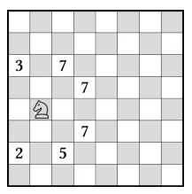

# Algorithme de Warnsdorff

L'algorithme de Warnsdorff propose une méthode calculatoire mais automatique pour réussir la danse du cavalier pour les échiquiers NxN avec N >= 5.

Pour que l'algorithme fonctionne à tous les coups, il est conseiillé de commencer dans un coin de l'échiquier.

Afin de déterminer le trajet du cavalier, il faut, pour chaque coup possible, calculer le nombre de **voisins**, c'est-à-dire le nombre de coups possibles à partir de cette case. Le coup ayant le moins de voisins est le prochain coup permettant de réussir la danse du cavalier.

En cas d'égalité, on choisira le coin le plus éloigné du centre

Dans cet exemple, on choisira la case marquée d'un 2, car elle possède seulement deux voisins.